<div align="center">
  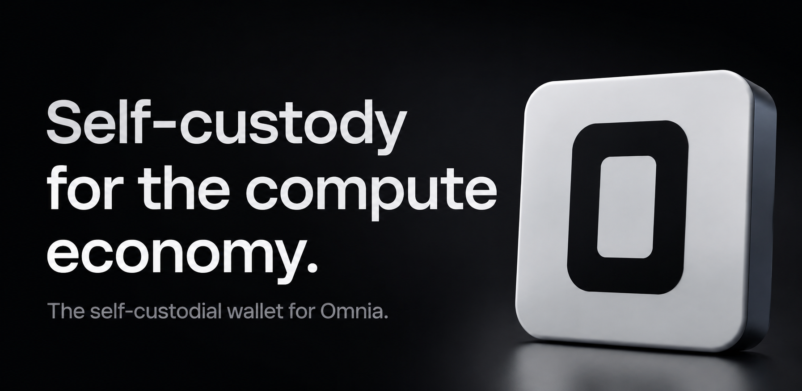
</div>

# Omnia Wallet

> **Self-custodial mobile wallet for the Omnia Protocol**

The wallet holds an Ed25519 keypair **on the device** (never a shared secret), derives an Omnia DID from the public key, and authenticates to an Omnia node with a challenge/signature login — or via **Supabase sign-in** (Google/GitHub/email) with node JWTs minted by an edge function (dual-mode auth).

**Shipped in v1**, live against the public testnet node. Note that this node
is the public ingress of a **standing 3-node geo-distributed validator
mesh** (Nuremberg / Ashburn / Singapore, 2 peers each), with **Lane 0
finality working** — so the per-transaction finality badges do light up.
Canonical Lane 1 height still reads 0 on a quiet network; see
[`benchmark-gates.md`](https://github.com/Willow7737/omnia-protocol/blob/main/docs/reference/benchmark-gates.md)
in the protocol repo for the measured numbers.

- **Balance, send, and transaction history** with per-transaction detail
  including **Lane 0 finality status** and signing provenance
- **Two assets**: soulbound UBC and a transferable ledger that actually
  credits the recipient — see below
- **Governance** — view, vote, and create proposals (quadratic voting)
- **QR send/receive** with request-amounts, plus an address book
- **Biometric app lock**, in-app notifications, and a team news feed
  with threaded replies and images
- Onboarding with BIP39 mnemonic backup / import

[](https://flutter.dev)
[](https://dart.dev)
[](https://opensource.org/licenses/MIT)

**Omnia Wallet** is a secure, self-custodial mobile application built with Flutter & Dart that brings Universal Basic Compute (UBC) to your pocket. Your keys, your identity, your control.

---

## ⚖️ Two assets, and the difference matters

The wallet holds two things that are **not** denominations of one currency:

| | **UBC** | **Transferable ledger** |
| :-- | :-- | :-- |
| What it is | Soulbound monthly compute rights | Value that moves between people |
| Sending it | Burns your quota; the recipient is **not** credited | Debits you, **credits the recipient** |
| Supply | Resets to your quota each epoch | Conserved by every transfer |
| Addressed by | `did:omnia:…` | Ed25519 **public key** |

UBC deliberately cannot move between identities — that is what stops
participation rights from being bought up and concentrated. The financial
ledger is the other half: value that actually reaches someone.

The Send screen asks which one you are moving, because both outcomes are
irreversible and they are not the same outcome. Full detail in
[The two economies](#-the-two-economies) below.

---

## 📱 App Preview

### Onboarding Experience

<div align="center">

| Stay in the Loop | Meet Your Wallet | Your Keys, Your DID | Send. Vote. Take Part |
|-----------------|------------------|---------------------|----------------------|
| 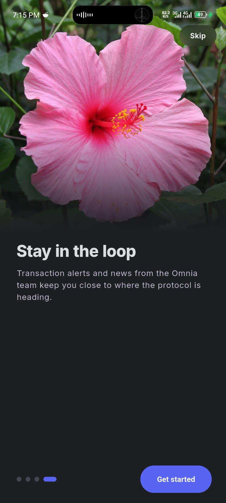 | 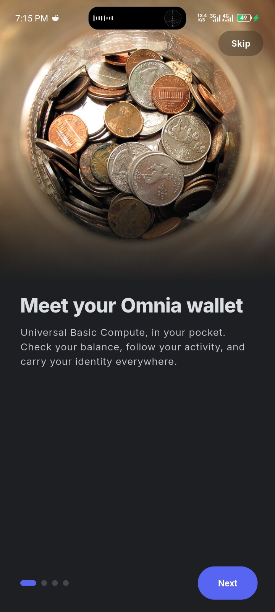 | 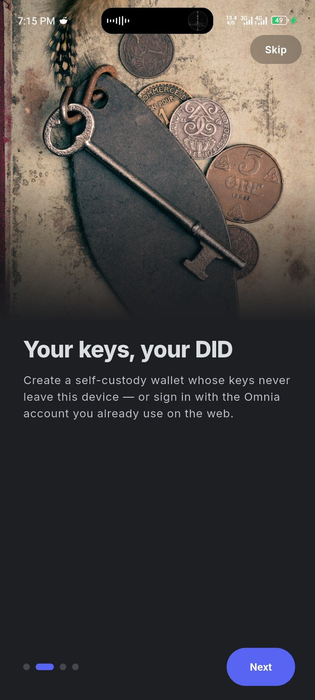 | 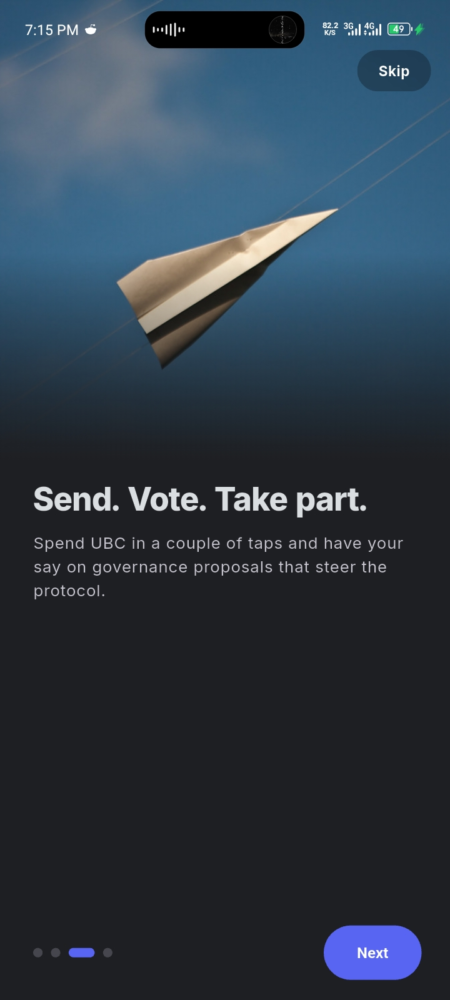 |

</div>

### Core Features

<div align="center">

| Welcome Screen | Settings | Profile | Transaction History |
|----------------|----------|---------|---------------------|
| 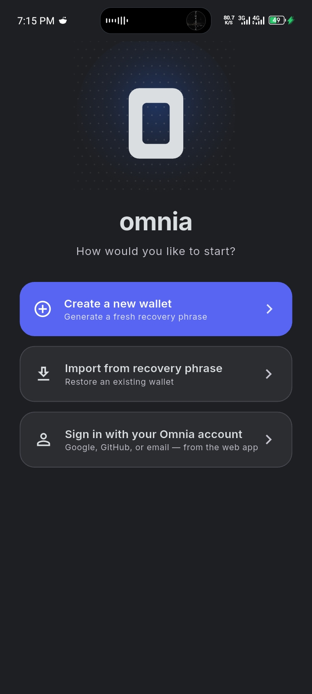 | 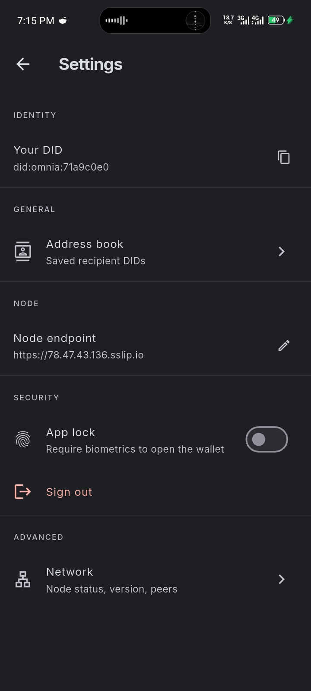 | 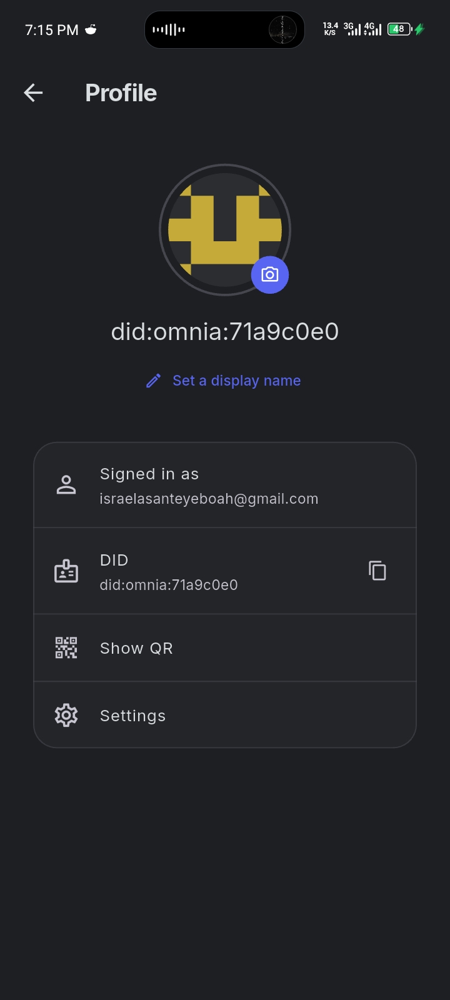 | 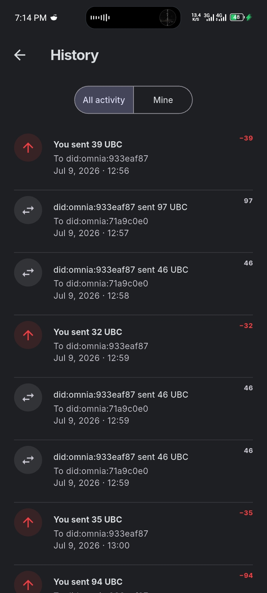 |

</div>

### Additional Features

<div align="center">

| Recovery Phrase | News Feed | Your DID QR | Send UBC | Home Balance |
|----------------|-----------|-------------|----------|--------------|
| 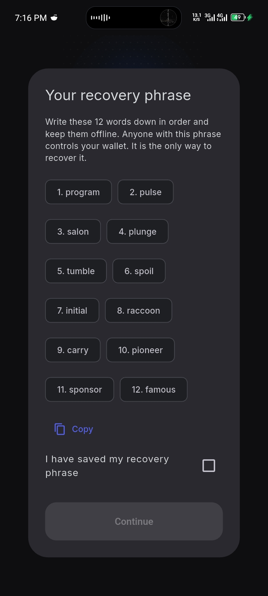 | 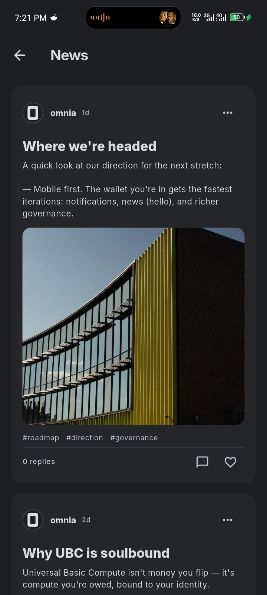 | 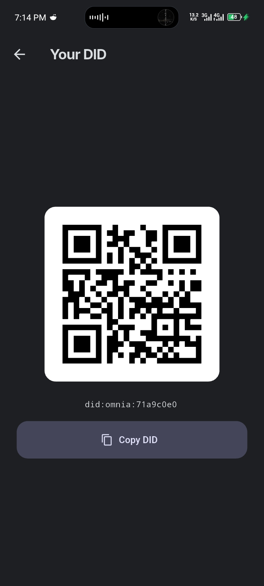 | 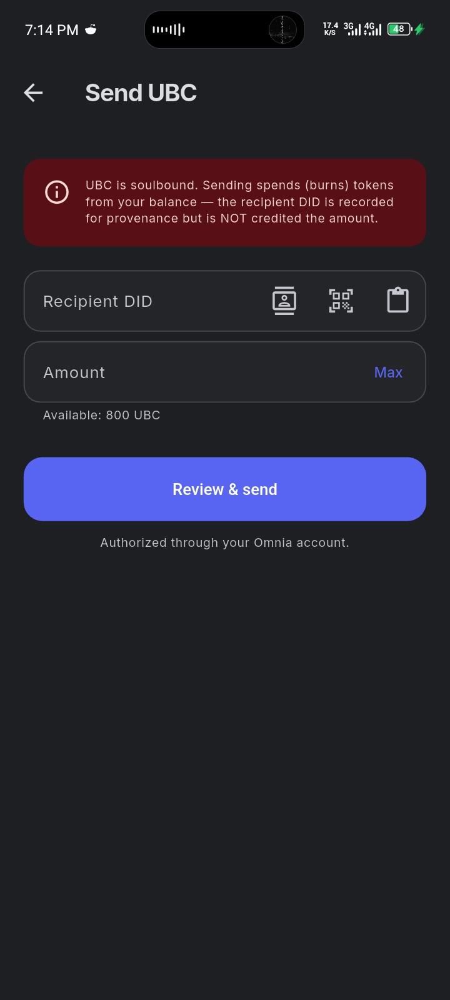 | 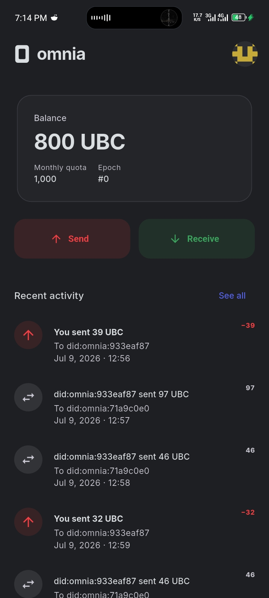 |

</div>

---

## 🔐 Security First

Omnia Wallet puts **your security first**:

- ✅ **Self-custodial**: Your Ed25519 private key is generated and stored **on-device only**
- ✅ **Never leaves device**: Private key never transmitted or shared
- ✅ **Secure storage**: Uses platform keychain/keystore via `flutter_secure_storage`
- ✅ **Biometric protection**: Optional biometric authentication before signing
- ✅ **BIP39 recovery**: 12-word mnemonic phrase for wallet backup (shown above)
- ✅ **Deterministic DID**: `did:omnia:` + SHA-256(public_key) - consistent across devices

---

## 🏗️ Architecture

```
┌─────────────────────────────────────────────────────────────┐
│                      Omnia Wallet                              │
├─────────────────────────────────────────────────────────────┤
│  lib/                                                           │
│  ├── core/           Config, theme, router, formatting        │
│  ├── crypto/         Ed25519 keygen/sign, DID derivation        │
│  │   └── key_manager.dart    # Key generation & storage      │
│  ├── data/           API client, models, repositories         │
│  │   ├── api_client.dart     # REST API communication        │
│  │   ├── auth_repository.dart # Authentication flow           │
│  │   └── wallet_repository.dart # Wallet operations          │
│  ├── state/          Riverpod providers (state management)   │
│  └── features/       UI feature modules                       │
│      ├── onboarding/  # Wallet creation & recovery            │
│      ├── home/        # Balance & overview                     │
│      ├── send/        # Send UBC or transferable value         │
│      ├── receive/     # Payment address + QR                   │
│      ├── history/     # Transaction history                   │
│      └── settings/    # Configuration & preferences            │
└─────────────────────────────────────────────────────────────┘

Challenge/Signature Login Flow:

┌──────────────┐  1. POST /api/v1/auth/challenge { public_key }  ┌────────────┐
│  Flutter app │ ─────────────────────────────────────────────────▶│ Omnia node │
│  (on device) │ ◀────────────── { did, nonce, message }            │  REST API  │
│              │                                                   │            │
│  Ed25519 key │  2. sign("omnia-auth:" + nonce) with private key    │            │
│              │ ─────────────────────────────────────────────────▶│            │
│              │  3. POST /api/v1/auth/login { public_key, signature }│            │
│              │ ◀────────────── { did, token (JWT) }               │            │
│              │  4. Authorization: Bearer <JWT> for all calls     │            │
└──────────────┘                                                   └────────────┘
```

---

## 🚀 Features

### ✅ Core v1 (Shipped)

- **On-device Ed25519 keypair** with BIP39 recovery phrase (create + import)
- **Secure key storage** using platform keychain/keystore
- **Challenge/signature login** → node JWT authentication
- **DID derivation** from public key (`did:omnia:` + SHA-256)
- **Balance display** with monthly quota and epoch information
- **Send UBC** with soulbound warning and biometric confirmation
- **Send transferable value** — pick the asset on the Send screen; the
  recipient is credited exactly what you are debited
- **Transaction history** with detailed activity tracking
- **Receive screen** showing your **payment address** (public key) as a QR,
  with your DID alongside it as identity
- **Settings**: Node endpoint configuration, recovery phrase reveal, wallet wipe
- **QR scanning** for recipient addresses on the Send screen
- **Address book**: save and label recipient DIDs
- **Governance**: list proposals, cast votes, create proposals (quadratic voting)
- **App-launch biometric lock** with auto-lock on background
- **Motion & haptics system**: Shared transitions, press feedback, animated balance
- **News feed** with protocol updates and governance information

### 🔜 Upcoming Features

- **Transfer history**: the activity list still shows UBC records only.
  Financial transfers are recorded on the causal graph (each returns an
  `event_id`) but are not yet surfaced in-app.
- **Funding the ledger**: `FinancialOp::Mint` requires a mint authority that
  is not configured, so transferable balances start at zero. Transfers work;
  who gets an opening balance is a genesis/governance decision.
- **Contacts for payment addresses**: contacts store DIDs, so the picker is
  hidden when sending transferable value.
- **Multi-account support**: Multiple DIDs from one seed
- **Push notifications** for incoming activity
- **Hardware-backed keys** (StrongBox / Secure Enclave)
- **Localization & accessibility** support

---

## 📦 Tech Stack

| Category | Technology | Purpose |
|----------|------------|---------|
| **Framework** | Flutter 3.22+ | Cross-platform mobile development |
| **Language** | Dart 3.4+ | Primary development language |
| **State Management** | Riverpod 2.5+ | Reactive state management |
| **Cryptography** | ed25519_edwards | Ed25519 key generation & signing |
| **BIP39** | bip39 | Mnemonic phrase backup/recovery |
| **Hashing** | crypto | SHA-256 for DID derivation |
| **Secure Storage** | flutter_secure_storage | Platform keychain/keystore |
| **Biometrics** | local_auth | Biometric authentication |
| **Networking** | dio | HTTP client for REST API |
| **QR Code** | qr_flutter, mobile_scanner | QR generation & scanning |
| **Navigation** | go_router | Declarative routing |
| **Authentication** | supabase_flutter | Mode B sign-in support |
| **UI** | flutter_svg | SVG vector art rendering |
| **Images** | image_picker, path_provider | Image handling |
| **Internationalization** | intl | Formatting & localization |

---

## 🛠️ Getting Started

### Prerequisites

- Flutter (stable, ≥ 3.22)
- Dart SDK (≥ 3.4.0)
- A running Omnia node exposing the REST API

### Installation

```bash
# Clone the repository
git clone https://github.com/Willow7737/Omnia-Wallet.git
cd Omnia-Wallet

# Install dependencies
flutter pub get

# Run on Android emulator (10.0.2.2 is host)
flutter run --dart-define=OMNIA_NODE_URL=http://10.0.2.2:9090

# Run on iOS simulator
flutter run --dart-define=OMNIA_NODE_URL=http://localhost:9090
```

### Running a Node Locally

From the `omnia-protocol` repository:

```bash
OMNIA_JWT_SECRET=dev-secret cargo run -p omnia-node
```

The wallet authenticates via challenge/signature flow at:
- `/api/v1/auth/challenge` - Get authentication challenge
- `/api/v1/auth/login` - Submit signed challenge for JWT

All economics endpoints require the JWT obtained from the login flow.

---

## 📁 Project Structure

```
omnia-wallet/
├── lib/
│   ├── core/              # App configuration, theme, router
│   │   ├── config.dart    # Environment configuration
│   │   ├── theme.dart     # App theming & styling
│   │   └── router.dart    # Navigation routes
│   │
│   ├── crypto/            # Cryptographic operations
│   │   ├── key_manager.dart # Ed25519 key generation, signing, DID
│   │   └── secure_store.dart # Secure storage wrapper
│   │
│   ├── data/              # Data layer
│   │   ├── models/        # Data models (DID, Transaction, etc.)
│   │   ├── api_client.dart # REST API client
│   │   ├── auth_repository.dart # Authentication logic
│   │   └── wallet_repository.dart # Wallet operations
│   │
│   ├── state/             # State management (Riverpod)
│   │   ├── auth_provider.dart # Authentication state
│   │   ├── wallet_provider.dart # Wallet state
│   │   └── settings_provider.dart # Settings state
│   │
│   └── features/          # UI feature modules
│       ├── onboarding/    # Wallet creation & recovery
│       ├── home/          # Main wallet screen
│       ├── send/          # Send flow (UBC or transferable)
│       ├── receive/       # Payment address + QR
│       ├── history/       # Transaction history
│       └── settings/      # App settings
│
├── android/               # Android platform code
├── ios/                   # iOS platform code
├── assets/                # Static assets
│   ├── logo/              # App logos
│   ├── illustrations/     # App illustrations
│   ├── brand_icons/        # Brand icons
│   ├── onboarding/        # Onboarding images
│   └── screenshots/       # App screenshots
│
├── test/                  # Tests (flat — no subdirectories)
│   ├── key_manager_test.dart        # DID/Ed25519 vectors
│   ├── financial_transfer_test.dart # Cross-language vectors vs the node
│   └── …                            # Widget, state and model tests
│
├── pubspec.yaml           # Flutter dependencies
├── README.md              # This file
├── ROADMAP.md             # Development roadmap
└── CREDITS.md             # Credits & acknowledgments
```

---

## 🧪 Testing

```bash
# Run static analysis
flutter analyze

# Run all tests
flutter test

# Run specific test file
flutter test test/key_manager_test.dart
```

CI runs `dart format --set-exit-if-changed` **before** analyze, so format
first or the job fails on whitespace:

```bash
dart format .
```

Tests include:
- SHA-256/DID derivation against canonical vectors
- Ed25519 key generation and signing
- Wallet state management
- Widget rendering and interactions
- **Cross-language agreement with the node** (`test/financial_transfer_test.dart`)

### Cross-language test vectors

The wallet and the node each implement the transfer authorization encoding
independently, and they interoperate only if their bytes match exactly. A
divergence would not fail loudly — it would silently produce signatures the
node rejects, in production only.

So the vectors in `test/financial_transfer_test.dart` are not invented: they
were produced by running the node's own `signed_transfer_message`
(`shards/src/financial/ops.rs`) and pasted in verbatim. The test asserts this
wallet reproduces that exact 107-byte message and the exact 64-byte
signature. A matching test on the node side
(`financial_transfer_accepts_the_wallets_exact_payload`) feeds the same
literals through the real HTTP handler.

Together they pin the whole path: **what the wallet signs is what the node
accepts.** Change either encoding and one of the two fails.

---

## 🚢 Releasing to Google Play

Release signing reads from `android/key.properties` (gitignored — see
`android/key.properties.example`); without it the `release` build falls back
to debug signing, which Play rejects. The full runbook — upload keystore,
building the signed AAB, Play Console listing, Data Safety form, and the
hosted privacy policy — is in **[RELEASE.md](./RELEASE.md)**. The privacy
policy Play requires is in **[PRIVACY.md](./PRIVACY.md)**. Pushing a `vX.Y.Z`
tag builds the AAB via `.github/workflows/release.yml`.

---

## 📊 The two economies

### UBC is soulbound — on purpose

When you "send" UBC:
- Tokens are **burned** from your balance (not transferred)
- The recipient DID is recorded for provenance
- The recipient does **NOT** receive the tokens
- This is a **spend** operation, not a transfer

This is not a limitation waiting to be fixed. A compute right that cannot be
bought, sold, or accumulated is what keeps participation from concentrating.
The Send screen states the behaviour plainly before you confirm.

### The financial ledger does move value

`POST /api/v1/financial/transfer` debits the sender and credits the
recipient; total supply is unchanged. The wallet signs each transfer
on-device:

```
"omnia-financial-transfer:v1" || from(32) || to(32) || amount_le(8) || nonce_le(8)
```

- **The node holds no spending authority.** It relays the transfer and signs
  the carrying event, but authority comes from your Ed25519 signature, which
  every node re-verifies when it applies the event. A node can decline to
  relay a payment; it cannot forge or alter one.
- **The domain tag is separate** from the UBC spend prefix
  (`omnia-transfer-v1`), so neither authorization can be replayed as the
  other.
- **Nonces are strictly increasing per sender**, making each authorization
  single-use — without that, an observed event would be a replayable bearer
  token. Read `next_nonce` immediately before signing; a stale value is
  rejected.
- **Supabase-mode accounts cannot send.** With no on-device key there is
  nothing to authorize with. That is the security property working, not a
  gap — there is deliberately no node-attested fallback here, unlike UBC
  spends.

### Why payment addresses are public keys, not DIDs

A `did:omnia:` is a **truncated SHA-256 of the public key** — a one-way hash.
The ledger verifies your Ed25519 signature, so it needs the actual verifying
key, and a DID cannot be converted back into one.

**You cannot be paid to a DID.** Share your payment address (64 hex
characters, shown on the Receive screen). Anyone holding it can still derive
your DID from it, so the address gives away nothing extra — and a recipient
needs no prior contact with any node to be paid.

---

## 🔗 API Endpoints

Every path below is one the wallet actually calls — see
[`lib/data/api_client.dart`](lib/data/api_client.dart).

### Authentication
- `POST /api/v1/auth/challenge` — Request authentication challenge
- `POST /api/v1/auth/login` — Submit signed challenge, receive JWT
- `POST /api/v1/auth/register` — Register a DID for an externally-minted JWT (Supabase mode)

### Economics — soulbound UBC
- `GET /api/v1/economics/balance/:did` — UBC balance, monthly quota, epoch
- `GET /api/v1/economics/transfers?limit=N` — Spend history
- `POST /api/v1/economics/transfer` — Spend (burn) UBC; credits nobody

### Financial — the transferable ledger
- `GET /api/v1/financial/balance/:pubkey` — Balance and `next_nonce`
- `POST /api/v1/financial/transfer` — Move value; credits the recipient

### Governance
- `GET /api/v1/governance/proposals` — List governance proposals
- `POST /api/v1/governance/proposals` — Create a proposal
- `POST /api/v1/governance/vote` — Cast a vote

### Node
- `GET /api/v1/node/info` — Version, peers, protocol version, Lane 0 counters

---

## 🎯 DID Format

Omnia DIDs follow this format:

```
did:omnia:<first_32_hex_chars_of_SHA256(public_key_bytes)>
```

**Example**: `did:omnia:71a9c0e0`

This format is:
- Deterministic: Same public key always produces the same DID
- Cross-platform: Consistent between wallet and node
- Verifiable: Both sides can independently derive the DID

A shared test vector (`did:omnia:4bb06f8e4e3a7715d201d573d0aa4237` for a 32-byte `0x07` key) is asserted in both the wallet and node test suites to prevent implementation drift.

---

## 📝 Configuration

### Environment Variables

| Variable | Description | Default |
|----------|-------------|---------|
| `OMNIA_NODE_URL` | Base URL of Omnia node | Required |

### Runtime Configuration

- **Node endpoint**: Editable from Settings → Node endpoint (persisted on device)
- **Biometric lock**: Toggle in Settings → Security
- **Recovery phrase**: View in Settings → Security → Show recovery phrase

---

## 🤝 Contributing

Contributions are welcome! Please follow these guidelines:

1. **Fork the repository** and create a feature branch
2. **Follow existing code style** and patterns
3. **Add tests** for new functionality
4. **Update documentation** as needed
5. **Submit a pull request** with clear description

### Development Workflow

```bash
# Create feature branch
git checkout -b feature/your-feature

# Make changes and test
flutter analyze
flutter test

# Commit changes
git commit -m "feat: add your feature"

# Push to fork
git push origin feature/your-feature
```

---

## 📄 License

This project is licensed under the MIT License - see the [LICENSE](LICENSE) file for details.

---

## 🙏 Acknowledgments

- Built with [Flutter](https://flutter.dev) and [Dart](https://dart.dev)
- Uses [Inter](https://rsms.me/inter/) font family
- Special thanks to all contributors and the Omnia Protocol team

---

## 📞 Support

- **Repository**: [github.com/Willow7737/Omnia-Wallet](https://github.com/Willow7737/Omnia-Wallet)
- **Protocol**: [github.com/Willow7737/omnia-protocol](https://github.com/Willow7737/omnia-protocol)
- **Issues**: Please report bugs and feature requests via GitHub Issues
